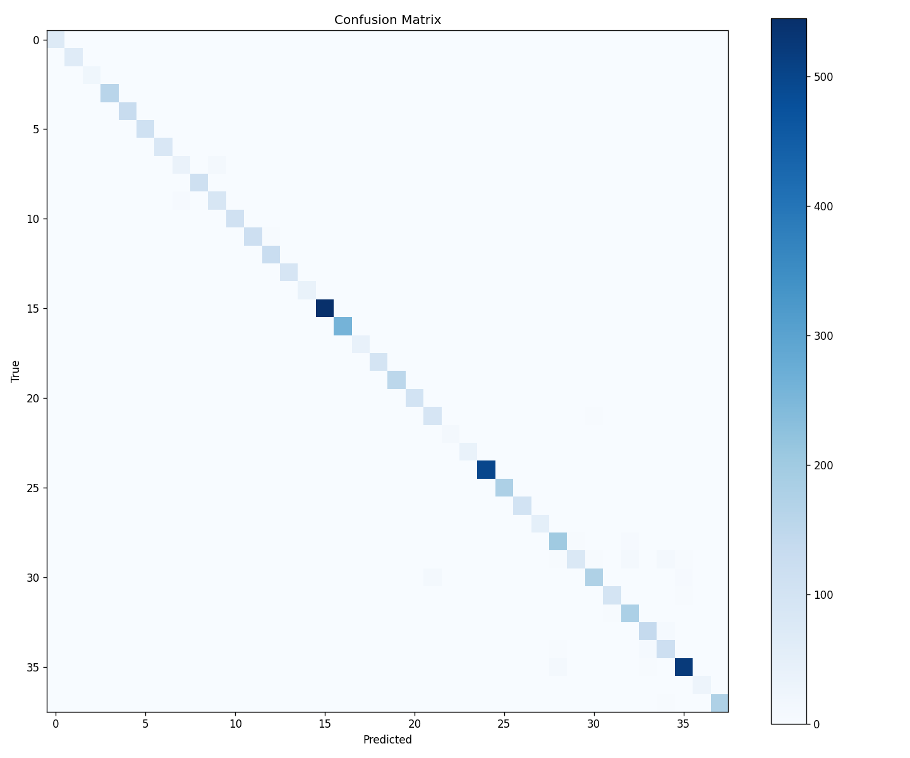

# Plant Disease Detection Using Transfer Learning — Project Report

**Course:** Machine Learning (full-semester project)
**Author:** (your name)
**Date:** 2026

---

## Abstract

Plant diseases are a major cause of crop loss worldwide, and early detection is critical
for food security. This project presents an image-classification system that identifies
plant leaf diseases from a single photograph. Using **transfer learning** with a
**MobileNetV2** convolutional neural network pre-trained on ImageNet, we fine-tune a
38-class classifier on the **PlantVillage** dataset (~54,000 leaf images across 14 crop
species). The trained model achieves **96.21% accuracy** on a held-out test
set. The model is deployed as an interactive web application using Gradio and hosted on
Hugging Face Spaces, allowing any user to upload a leaf photo and receive an instant
diagnosis with confidence scores.

## 1. Introduction

### 1.1 Motivation
Agriculture is highly vulnerable to plant diseases, which can devastate yields if not
caught early. Manual diagnosis requires expert knowledge that many farmers lack access
to. An automated tool that diagnoses disease from a phone photo could democratize this
expertise.

### 1.2 Objective
Build an end-to-end machine learning system that:
1. Classifies a plant leaf image into one of 38 categories (healthy or specific disease).
2. Achieves high accuracy (target ≥ 95%).
3. Is accessible to non-technical users through a simple web interface.

### 1.3 Scope
The project covers the full ML lifecycle: data acquisition and exploration, model
training and evaluation, and deployment of a live demo.

## 2. Background

### 2.1 Convolutional Neural Networks (CNNs)
CNNs are the standard architecture for image classification. They learn hierarchical
visual features (edges → textures → object parts) through stacked convolutional layers.

### 2.2 Transfer Learning
Training a CNN from scratch requires enormous datasets and compute. **Transfer learning**
reuses a network already trained on a large dataset (ImageNet, ~1.2M images) and adapts
it to a new task. We freeze the pre-trained feature extractor and train only a new
classification head, dramatically reducing data and compute needs while retaining high
accuracy.

### 2.3 MobileNetV2
MobileNetV2 is a lightweight CNN designed for efficiency, using depthwise-separable
convolutions and inverted residual blocks. Its small size (~3.5M parameters) makes it
ideal for fast training on a free GPU and for low-latency deployment.

## 3. Dataset

| Property | Value |
|---|---|
| Name | PlantVillage |
| Images | ~54,000 |
| Classes | 38 (healthy + diseased across 14 crops) |
| Crops | Apple, Tomato, Potato, Grape, Corn, etc. |
| Format | RGB leaf photographs |

**Preprocessing:** images resized to 224×224 and normalized with ImageNet mean/std.
**Splits:** 80% train / 10% validation / 10% test, drawn with a fixed random seed (42)
for reproducibility.
**Augmentation (train only):** random horizontal flip, ±20° rotation, and color jitter,
to improve generalization and reduce overfitting.

## 4. Methodology

### 4.1 Model architecture
- **Backbone:** MobileNetV2 pre-trained on ImageNet (feature extractor **frozen**).
- **Head:** the original 1000-class classifier replaced with a new fully-connected layer
  of 38 outputs.

### 4.2 Training configuration
| Hyperparameter | Value |
|---|---|
| Loss | Cross-entropy |
| Optimizer | Adam |
| Learning rate | 1e-3 |
| LR schedule | Step decay (×0.5 every 2 epochs) |
| Batch size | 32 |
| Epochs | 5 |
| Hardware | NVIDIA T4 GPU (Google Colab, free tier) |

### 4.3 Training procedure
The model was trained for 5 epochs, saving the checkpoint with the best validation
accuracy. Because only the classifier head is trained, each epoch is fast and the model
converges quickly.

## 5. Results

> _Fill these in from your Colab run output._

- **Test accuracy:** 96.21%
- **Best validation accuracy:** 96.41%

| Epoch | Train accuracy | Validation accuracy |
|---|---|---|
| 1 | 0.867 | 0.938 |
| 2 | 0.925 | 0.952 |
| 3 | 0.937 | 0.958 |
| 4 | 0.941 | 0.963 |
| 5 | 0.944 | 0.964 |

Validation accuracy rises smoothly and tracks training accuracy closely, indicating the
model generalizes well without significant overfitting.

### 5.1 Confusion matrix
The confusion matrix (see `app/confusion_matrix.png`) shows predictions are concentrated
on the diagonal, indicating strong per-class performance. Most confusion occurs between
visually similar diseases of the same crop.

### 5.2 Qualitative results
The deployed app returns the top-3 most likely classes with confidence scores. On clear,
well-lit single-leaf photos the top prediction is typically correct with high confidence.

## 6. Deployment

The trained model is served through a **Gradio** web application (`app/app.py`) that:
1. Accepts an uploaded leaf image.
2. Applies the same preprocessing used in training.
3. Returns the top-3 predicted classes with confidence scores.

The app is hosted on **Hugging Face Spaces**, providing a public URL accessible from any
browser. Live demo: https://huggingface.co/spaces/Raghuram04/plant-disease

## 7. Discussion

### 7.1 Strengths
- High accuracy with minimal training time, thanks to transfer learning.
- Lightweight model suitable for real-time inference.
- Fully reproducible pipeline (fixed seeds, documented hyperparameters).
- Accessible to non-experts via the web app.

### 7.2 Limitations
- PlantVillage images are captured in controlled conditions (uniform backgrounds); the
  model may be less accurate on real-world field photos with clutter and varied lighting.
- Limited to the 38 classes present in the dataset; unseen crops/diseases are not handled.
- The model reports confidence but is not calibrated, so confidence values should be read
  qualitatively.

## 8. Future Work

- **Domain robustness:** fine-tune on field photos to close the lab-to-field gap.
- **Explainability:** add Grad-CAM heatmaps to show which leaf regions drive predictions.
- **Larger backbones:** compare against ResNet50 / EfficientNet for accuracy trade-offs.
- **Mobile deployment:** export to a mobile-friendly format (TorchScript / ONNX) for an
  offline phone app.

## 9. Conclusion

This project delivered a complete, working plant disease classification system — from raw
data to a deployed, publicly accessible web app — using transfer learning with
MobileNetV2 on the PlantVillage dataset. It demonstrates that modern transfer-learning
techniques make high-accuracy computer vision achievable with modest resources, and that
such models can be packaged into genuinely useful tools.

## References

1. Mohanty, S. P., Hughes, D. P., & Salathé, M. (2016). *Using Deep Learning for
   Image-Based Plant Disease Detection.* Frontiers in Plant Science.
2. Sandler, M. et al. (2018). *MobileNetV2: Inverted Residuals and Linear Bottlenecks.*
   CVPR.
3. Deng, J. et al. (2009). *ImageNet: A Large-Scale Hierarchical Image Database.* CVPR.
4. PlantVillage Dataset — Kaggle.
